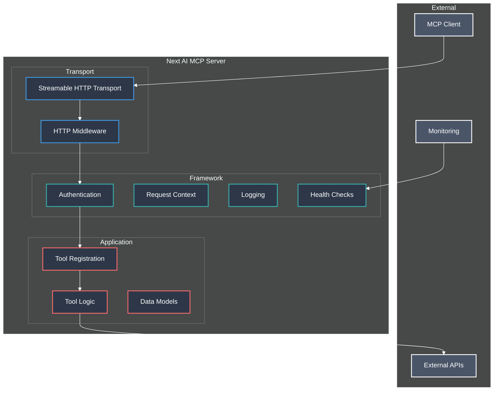
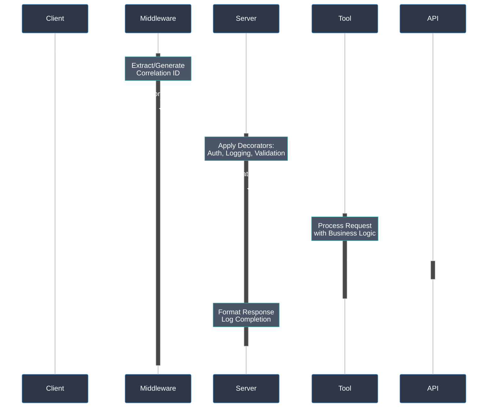
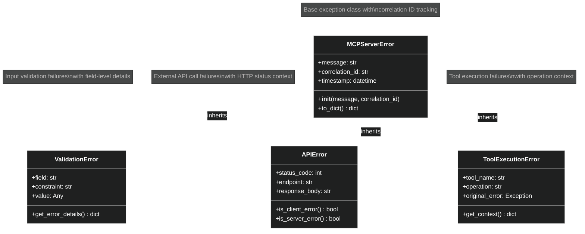

# Next AI MCP Server - Architecture

## Executive Summary

The Next AI MCP Server is a production-ready Model Context Protocol (MCP) server built with Python 3.12 and FastMCP. It demonstrates a framework-based architecture with clear separation between infrastructure and business logic.

### Key Features
- **Framework-Based Architecture**: Separation between framework code (`framework/`) and developer code (`src/`)
- **Streamable HTTP Transport**: Real-time communication via Streamable HTTP protocol
- **API Key Authentication**: Configurable authentication with HTTP headers
- **Request Tracing**: Correlation ID tracking for debugging and monitoring
- **Health Monitoring**: Dedicated health check server
- **Type Safety**: Pydantic validation throughout
- **Sample Tools**: Weather data, statistics, and text processing

### Technology Stack
- **Runtime**: Python 3.12+
- **Framework**: FastMCP (MCP protocol implementation)
- **Transport**: Streamable HTTP (SSE deprecated)
- **Validation**: Pydantic v2
- **HTTP Client**: httpx (async)
- **Configuration**: Environment variables

---

## System Architecture



### Architectural Principles

1. **Framework Separation**: Infrastructure code separate from business logic
2. **Type Safety**: Comprehensive Pydantic validation
3. **Async-First**: Non-blocking operations throughout
4. **Request Tracing**: Correlation ID tracking for observability
5. **Configuration Management**: Environment-based configuration

---

## Framework Structure

The server separates stable infrastructure code from customizable application code:

```
framework/                  # Infrastructure (rarely changes)
├── core/                  # Configuration, context, logging
├── decorators/            # Authentication, logging, error handling
├── middleware/            # HTTP request processing
├── server/                # Server factory and tool registration
└── health/               # Health check server

src/                       # Application code (developer focus)
├── server.py             # Tool registration
├── tools.py              # Business logic
├── models.py             # Data models
└── custom/               # Additional custom modules
```

### Framework Benefits

- **Developer Focus**: Only modify files in `src/` directory
- **Automatic Features**: Authentication, logging, error handling provided
- **Consistency**: Uniform patterns across all tools
- **Extensibility**: Easy to add new tools

---

## Core Components

### Application Layer (`src/`)
- **server.py**: Tool registration with FastMCP and decorator application
- **tools.py**: Business logic implementation with external API integration
- **models.py**: Pydantic data models for validation and type safety

### Framework Layer (`framework/`)
- **decorators/**: Cross-cutting concerns (`@require_api_key`, `@log_requests`, `@handle_exceptions`)
- **middleware/**: HTTP request processing and correlation ID management
- **server/**: Server factory and tool registration utilities (`create_mcp_server`, `register_tool`)
- **core/**: Configuration, context management, and logging infrastructure
- **health/**: Health monitoring with dedicated HTTP server

---

## Data Flow



---

## Error Handling

### Exception Hierarchy



### Error Features
- **Structured Exceptions**: Custom hierarchy with correlation ID tracking
- **Automatic Logging**: All errors logged with request context
- **Error Sanitization**: Safe error messages to prevent information leakage

---

## Deployment

### Runtime Requirements
- **Python 3.12+** with virtual environment
- **Environment Variables** for configuration
- **Streamable HTTP Server** for MCP protocol communication
- **Health Check Server** for monitoring

### Configuration
Configuration sources (priority order):
1. Environment variables
2. `.env` file
3. Framework defaults

Key settings:
- **Server**: Host, port, transport
- **Authentication**: API key configuration
- **Logging**: Levels and output destinations
- **Health**: Monitoring endpoints

---

## Security

### Security Features
- **API Key Authentication**: Environment-based with configurable headers
- **Input Validation**: Comprehensive Pydantic validation
- **Request Tracing**: Correlation ID tracking for audit trails
- **Error Sanitization**: Prevent information leakage
- **Context Isolation**: Thread-safe request management

### Security Patterns
- **Validation-First**: All inputs validated before processing
- **Fail-Safe Defaults**: Secure configuration defaults
- **Audit Trail**: Complete request tracing

---

## Adding New Tools

### Development Steps
1. **Define Logic**: Add async function in `src/tools.py`
2. **Create Models**: Add Pydantic models in `src/models.py`
3. **Register Tool**: Add registration in `src/server.py`

### Automatic Features
New tools automatically receive:
- **Authentication** via `@require_api_key` decorator
- **Logging** with correlation ID tracking
- **Error Handling** with structured exceptions
- **Input Validation** through Pydantic models

### Example Tool Pattern
```python
# src/tools.py
async def my_tool(input_param: str) -> MyToolResponse:
    """Business logic implementation."""
    logger = get_app_logger()
    logger.info(f"Processing: {input_param}")
    
    # Your business logic here
    result = process_data(input_param)
    
    return MyToolResponse(result=result)

# src/models.py
class MyToolParams(BaseModel):
    input_param: str = Field(..., description="Input parameter")

class MyToolResponse(BaseModel):
    result: str = Field(..., description="Tool result")

# src/server.py
@register_tool(server, "my_tool")
async def my_tool_wrapper(params: MyToolParams) -> Dict[str, Any]:
    """My custom tool description."""
    result = await my_tool(params.input_param)
    return result.model_dump()
```

This architecture provides a solid foundation for building scalable MCP servers with clear separation of concerns, comprehensive error handling, and production-ready features.
